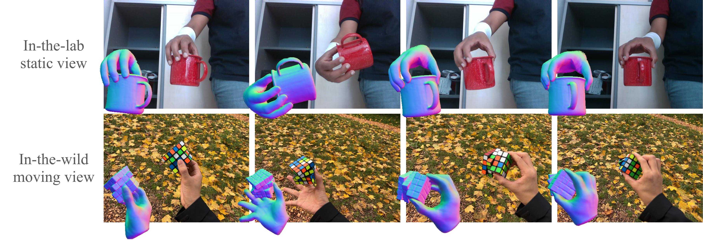
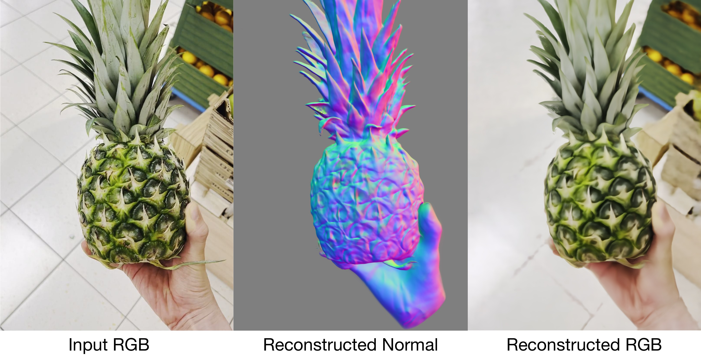
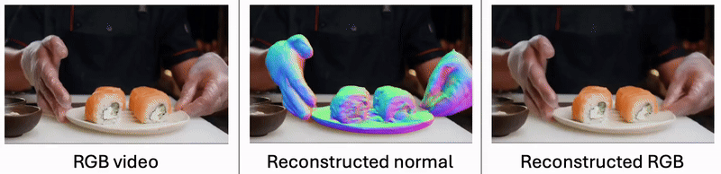

## [CVPR'24 Highlight] HOLD: Category-agnostic 3D Reconstruction of Interacting Hands and Objects from Video

<p align="center">
    
</p>

[ [Project Page](https://zc-alexfan.github.io/hold) ]
[ [Paper](https://download.is.tue.mpg.de/hold/paper.pdf) ]
[ [SupMat](https://openaccess.thecvf.com/content/CVPR2024/supplemental/Fan_HOLD_Category-agnostic_3D_CVPR_2024_supplemental.pdf) ]
[ [ArXiv](https://arxiv.org/abs/2311.18448) ]
[ [Video](https://youtu.be/xm6WSkr2sIs) ]
[ [HOLD Account](https://hold.is.tue.mpg.de/) ]
[ [ECCV'24 HOLD+ARCTIC Challenge](https://hands-workshop.org/challenge2024.html) ]


Authors: [Zicong Fan](https://zc-alexfan.github.io/), [Maria Parelli](https://scholar.google.com/citations?user=ipSS2ToAAAAJ&hl=en), [Maria Eleni Kadoglou](https://ch.linkedin.com/in/marialena-kadoglou-337a10226), [Muhammed Kocabas](https://ps.is.mpg.de/person/mkocabas), [Xu Chen](https://xuchen-ethz.github.io/), [Michael J. Black](https://ps.is.mpg.de/person/black), [Otmar Hilliges](https://ait.ethz.ch/people/hilliges)


### News

🚀 Register a HOLD account [here](https://hold.is.tue.mpg.de/register.php) for news such as code release, downloads, and future updates!

- 2024.07.04: Join our [ECCV competition](https://hands-workshop.org/challenge2024.html): Two hand + rigid object using HOLD on ARCTIC!
- 2024.07.04: HOLD beta is released!
- 2024.04.04: HOLD is awarded CVPR highlight!
- 2024.02.27: HOLD is accepted to CVPR'24! Working on code release!

<p align="center">
    
</p>


This is a repository for HOLD, a method that jointly reconstructs hands and objects from monocular videos without assuming a pre-scanned object template. 

HOLD can reconstruct 3D geometries of novel objects and hands:

<p align="center">
    
    
</p>

### Potential directions from HOLD

- [Template-free bimanual hand-object reconstruction](https://hands-workshop.org/challenge2024.html#challenge2)
- [Textureless object interaction with hands](https://github.com/zju3dv/DetectorFreeSfM)
- [Multiple objects interaction with hands](https://www.projectaria.com/datasets/hot3d/)

<p align="center">

</p>

### Features

- Instructions to download in-the-wild videos from HOLD as well as preprocessed data
- Scripts to preprocess and train on custom videos
- A volumetric rendering framework to reconstruct dynamic hand-object interaction
- A generalized codebase for single and two hand interaction with objects
- A viewer to interact with the prediction
- Code to evaluate and compare with HOLD in HO3D

### TODOs

- [ ] Tips on good reconstruction
- [ ] Clean the code further
- [X] Support arctic for two-hand + rigid object setting

### Documentation

- Setup environment and downloads: see [`docs/setup.md`](docs/setup.md)
- Training, evaluation, and visualization on preprocessed sequences: see [`docs/usage.md`](docs/usage.md)
- Preprocess custom sequences: see [`docs/custom.md`](docs/custom.md)
- Data documentation (checkpoints, dataset, log folder): see [`docs/data_doc.md`](docs/data_doc.md)
- Instructions for using HOLD on ARCTIC: see [`docs/arctic.md`](docs/arctic.md)

### Getting started

Get a copy of the code:

```bash
git clone https://github.com/zc-alexfan/hold.git
cd hold; git submodule update --init --recursive
```

1. **Setup environments**
    - Follow the instructions here: [`docs/setup.md`](docs/setup.md).
    - You may skip external dependencies for now.

1. **Train on a preprocessed sequence**
   - Start with one of our preprocessed in-the-wild sequences, such as `hold_bottle1_itw`.
   - Familiarize yourself with the usage guidelines in [`docs/usage.md`](docs/usage.md) for this preprocessed sequence.
   - This will enable you to train, render HOLD, and experiment with our interactive viewer.
   - At this stage, you can also explore the HOLD code in the `./code` directory.

1. **Set up external dependencies and process custom videos**
   - After understanding the initial tools, set up the "external dependencies" as outlined in [`docs/setup.md`](docs/setup.md).
   - Preprocess the images from the `hold_bottle1_itw` sequence by following the instructions in [`docs/custom.md`](docs/custom.md).
   - Train on this sequence to learn how to build a custom dataset.
   - You can capture your own custom video and reconstruct it in 3D at this point.
   - Most preprocessing artifact files are documented in [`docs/data_doc.md`](docs/data_doc.md), which you can use as a reference.

1. **Two-hand setting**: Bimanual category-agnostic reconstruction
    - At this point, you can preprocess and train on a custom single-hand sequence. 
    - Now you can take on the bimanual category-agnostic reconstruction challenge!
    - Following the instruction in [`docs/arctic.md`](docs/arctic.md) to reconstruct two-hand manipulation of ARCTIC sequences.

### Official Citation 

```bibtex
@inproceedings{fan2024hold,
  title={{HOLD}: Category-agnostic 3d reconstruction of interacting hands and objects from video},
  author={Fan, Zicong and Parelli, Maria and Kadoglou, Maria Eleni and Kocabas, Muhammed and Chen, Xu and Black, Michael J and Hilliges, Otmar},
  booktitle={Proceedings of the IEEE/CVF Conference on Computer Vision and Pattern Recognition},
  pages={494--504},
  year={2024}
}
```

> ✨CVPR 2023: ARCTIC is a dataset that includes accurate body/hand/object poses, multi-view RGB videos for articulated object manipulation. See our [project page](https://github.com/zc-alexfan/arctic) for details.
>
> <p align="center">
>      <!-- Adjust width as needed -->
> </p>
>


### Star History

[](https://star-history.com/#zc-alexfan/hold&Date)


### Contact

For technical questions, please create an issue. For other questions, please contact the [first author](https://zc-alexfan.github.io/).

### Acknowledgments

The authors would like to thank: [Benjamin Pellkofer](https://ps.is.mpg.de/person/bpellkofer) for IT/web support; [Chen Guo](https://ait.ethz.ch/people/cheguo), [Egor Zakharov](https://ait.ethz.ch/people/egorzakharov), [Yao Feng](https://ps.is.mpg.de/person/yfeng), [Artur Grigorev](https://ait.ethz.ch/people/agrigorev) for insightful discussion; [Yufei Ye](https://judyye.github.io/) for DiffHOI code release. 

Our code benefits a lot from [Vid2Avatar](https://github.com/MoyGcc/vid2avatar), [aitviewer](https://github.com/eth-ait/aitviewer), [VolSDF](https://github.com/lioryariv/volsdf), [NeRF++](https://github.com/Kai-46/nerfplusplus) and [SNARF](https://github.com/xuchen-ethz/snarf). If you find our work useful, consider checking out their work.
