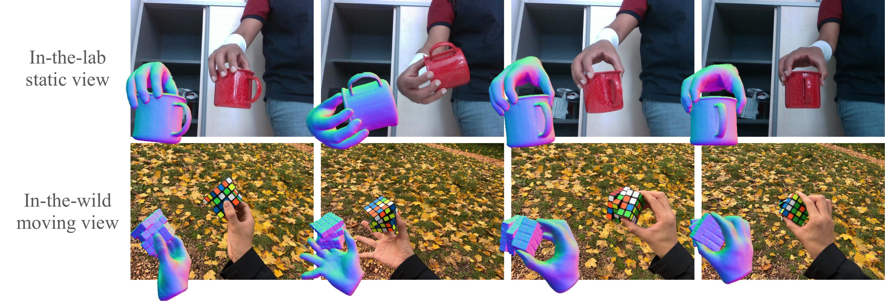
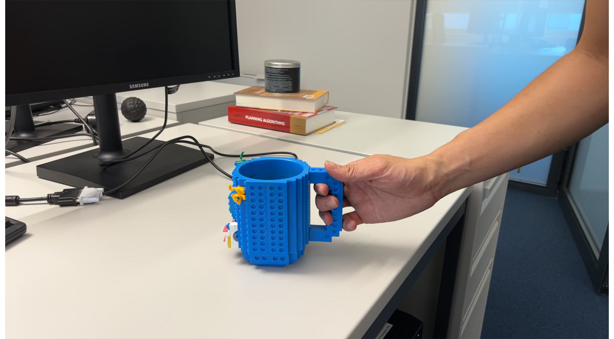

## HOLD: Category-agnostic 3D Reconstruction of Interacting Hands and Objects from Video

<p align="center">
    
</p>

[ [Project Page](https://zc-alexfan.github.io/hold) ]
[ [Paper](https://download.is.tue.mpg.de/hold/paper.pdf) ]
[ [ArXiV](https://arxiv.org/abs/2311.18448) ]
[ [Video](https://download.is.tue.mpg.de/hold/video.mp4) ]

## Overview

This is a repository for HOLD, a method that jointly reconstructs hands and objects from monocular videos without assuming a pre-scanned object template. 

<p align="center">
    
</p>


HOLD can reconstruct 3D geometries of novel objects and hands:

<p align="center">
    
</p>

<p align="center">
    
</p>


## Abstract 

Since humans interact with diverse objects every day, the holistic 3D capture of these interactions is important to understand and model human behaviour. However, most existing methods for hand-object reconstruction from RGB either assume pre-scanned object templates or heavily rely on limited 3D hand-object data, restricting their ability to scale and generalize to more unconstrained interaction settings. To this end, we introduce HOLD -- the first category-agnostic method that reconstructs an articulated hand and object jointly from a monocular interaction video. We develop a compositional articulated implicit model that can reconstruct disentangled 3D hand and object from 2D images. We also further incorporate hand-object constraints to improve hand-object poses and consequently the reconstruction quality. Our method does not rely on 3D hand-object annotations while outperforming fully-supervised baselines in both in-the-lab and challenging in-the-wild settings. Moreover, we qualitatively show its robustness in reconstructing from in-the-wild videos. 

## More results

> See more results on our [project page](https://zc-alexfan.github.io/hold)! 


```bibtex
@article{fan2024hold,
  title={{HOLD}: Category-agnostic 3D Reconstruction of Interacting Hands and Objects from Video},
  author={Fan, Zicong and Parelli, Maria and Kadoglou, Maria Eleni and Kocabas, Muhammed and Chen, Xu and Black, Michael J and Hilliges, Otmar},
  booktitle = {Proceedings IEEE Conference on Computer Vision and Pattern Recognition (CVPR)},
  year = {2024}
}
```

## Star History

[](https://star-history.com/#zc-alexfan/hold&Date)
